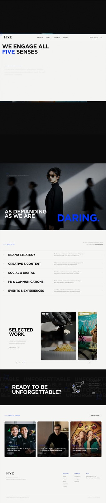
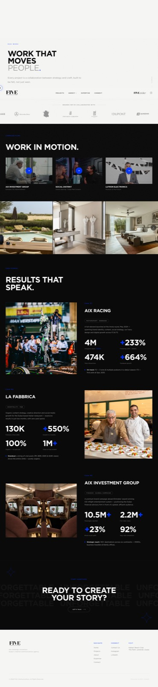
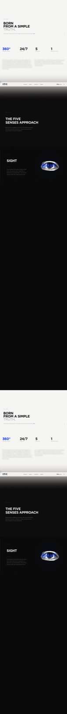
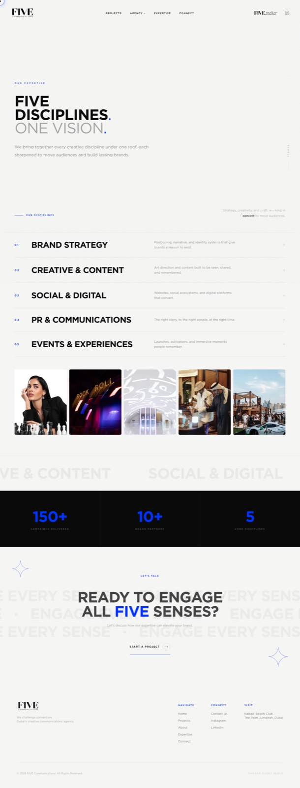
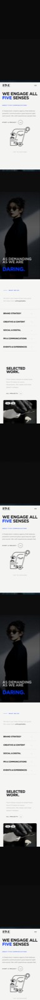

# FIVE Communications, commfive.com

Archived snapshot of the FIVE Communications website, a Dubai creative communications agency. Captured 18 September 2026, before any post-handover changes.

**Live archive:** https://su-zen-404.github.io/five-communications-website/

## My role

Design and front-end build of a custom WordPress theme from scratch: no page builder, no starter theme.

- Custom PHP theme with a tokenised type scale and spacing system
- Scroll-driven homepage: pinned hero video, GSAP ScrollTrigger reveals, Lenis smooth scroll
- 75-image curated projects grid with category ordering and a film reel section
- Journal with magazine-style article layouts
- Performance and hardening work on Cloudways (caching, WAF, plugin cull)

## Stack

WordPress, custom PHP theme, vanilla CSS with design tokens, GSAP 3 (ScrollTrigger, SplitText, ScrambleText), Lenis, Cloudways hosting.

## Screens

| Projects | About | Expertise |
| --- | --- | --- |
|  |  |  |

| Mobile home | Mobile projects |
| --- | --- |
|  |  |

## About this repository

This is a static mirror of the live site at the time of capture, served with GitHub Pages. All assets are local; nothing loads from the client's server. The WordPress source theme is not included here.

The live site is set in Gotham, a licensed typeface that cannot be redistributed. This archive substitutes the closest geometric sans available on the viewer's system (Avenir Next on macOS and iOS, Segoe UI on Windows, Roboto on Android), so metrics differ slightly from the original. The screenshots above show the site in Gotham as shipped.

Brand assets, photography and copy belong to FIVE Communications and its clients and are shown here for portfolio purposes only.
